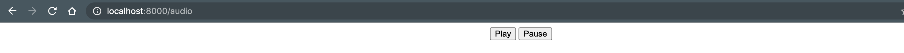

expressjs app
-------------

```
npm install

npm start

```


usage
-------

```
$ curl --request GET http://127.0.0.1:8000 | python -m json.tool
{
    "destination": "NORTH 30TH ST",
    "miles": 14
}
```


audio streaming
----------------



